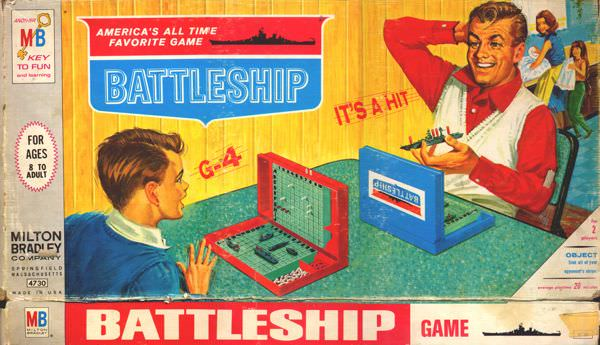

# Battleship Board Game
##### by Cristina Martinez, Cristina Mantiñán, Javier Melo

### How to Play the Battleship Board Game?
        
**1.** In this game you are going to play against the computer

**2.** Each fleet is composed of 10 ships of 4 different types.

**3.** If you want to play you should write 'yes' to go ahead once the program has started.

**4.** You have to introduce your username to play.

**5.** To attempt to hit the opponent's enemy ships, the coordinates of the locations must be              entered as:

* "coor x: and coor y" expression
* So On your turn, call out x,y coordinats that identifies a row and column on your target grid.
* The coordinates must be integers between 0 and 9.

**6.** The winner is the one that take down the opponent's fleet.
        
### Modules used

The following modules have been used in the development

* [numpy](https://numpy.org/)
* [random](https://docs.python.org/3/library/random.html)
* [os](https://docs.python.org/3/library/os.html?highlight=os#module-os)

